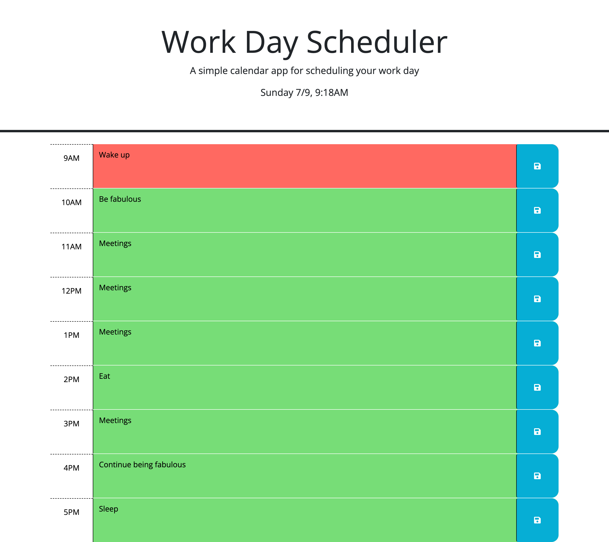

# JQUERY WORKDAY PLANNER
  
## Description:
  This is a simple calendar application that allows users to add events to 9-5 timeblocks. This app stores event details persistently using local storage, and time blocks change classes with time to visually represent the passage of the workday.
  
## Table of Contents:
  <ol>
    <li><a href="#description">Description</a>
    <li><a href="#preview">Preview</a>
    <li><a href="#license">License</a>
    <li><a href="#techused">Technology/Resources Used</a>
    <li><a href="#contact">Contact Me</a>
  </ol>

## Preview:
  <a href="https://hanwol525.github.io/05-jQuery-Planner/">Deployed page link</a>
  

## License:
  No license

## Technology/Resources Used:
  - jQuery
  - dayjs
  
## Questions:
  For any additional questions, please contact me! You can reach me via:
  <ul>
    <li> Github: <a href="https://github.com/hanwol525">hanwol525</a>
    <li> Email: <a href="mailto:hannahwolfson05@gmail.com">hannahwolfson05@gmail.com</a>
  </ul>
